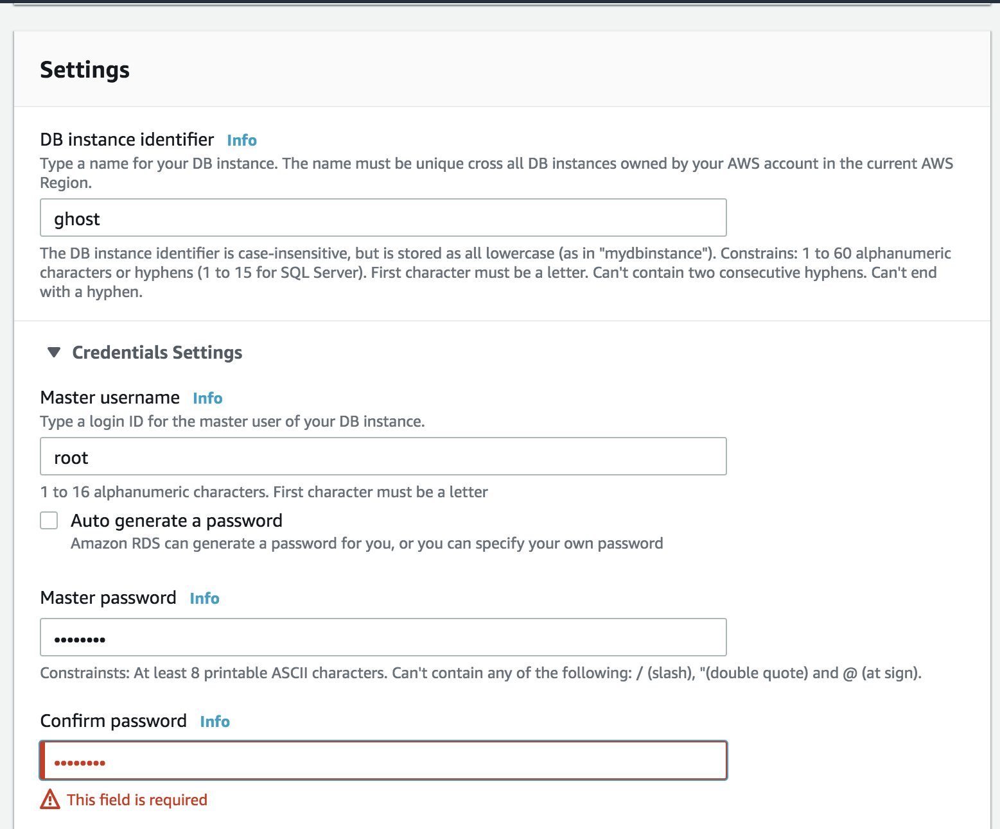
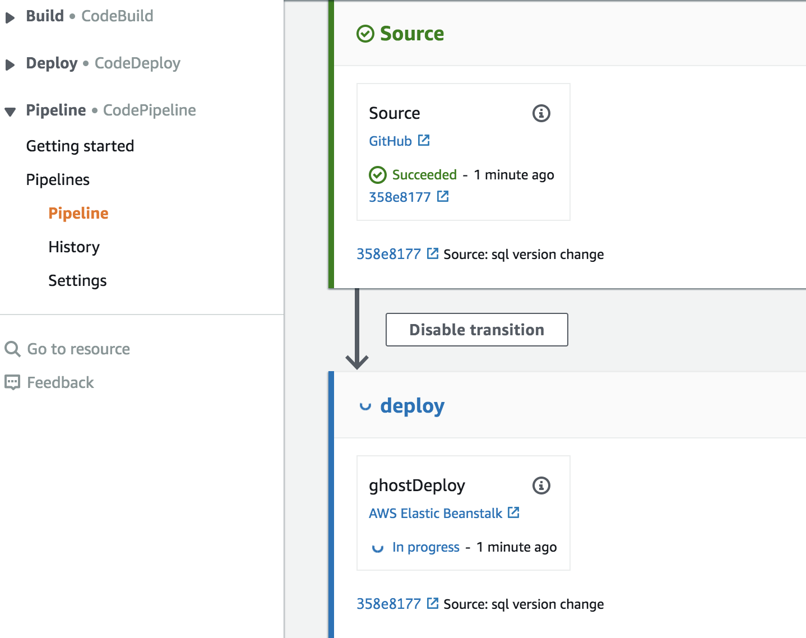
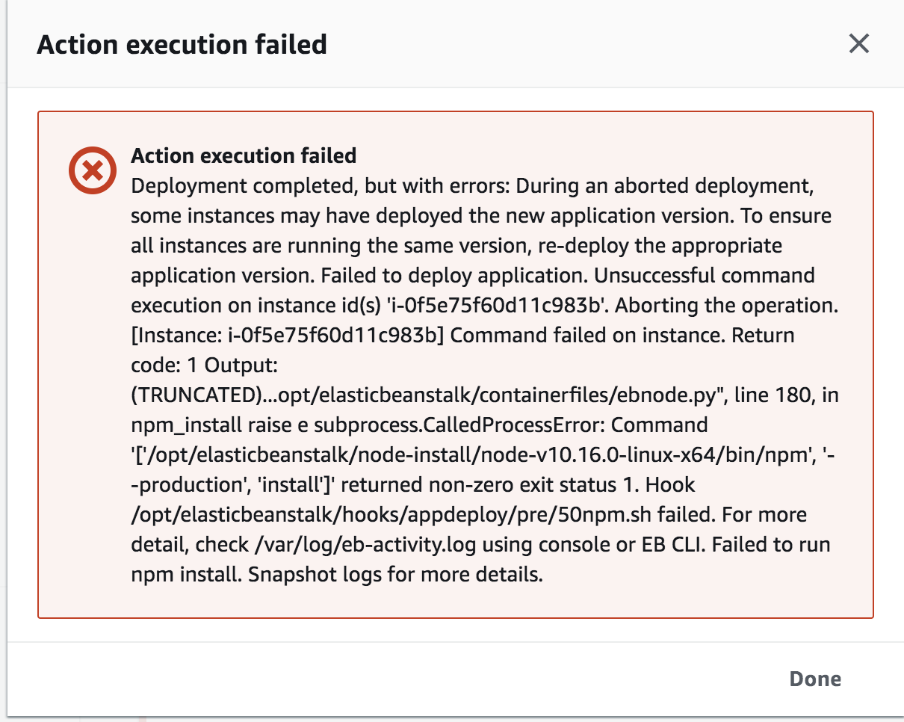
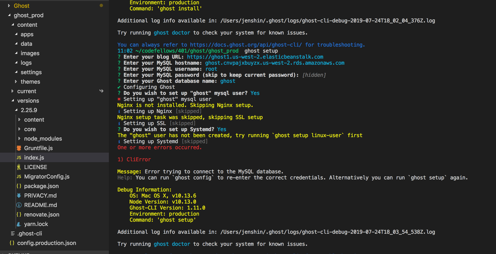
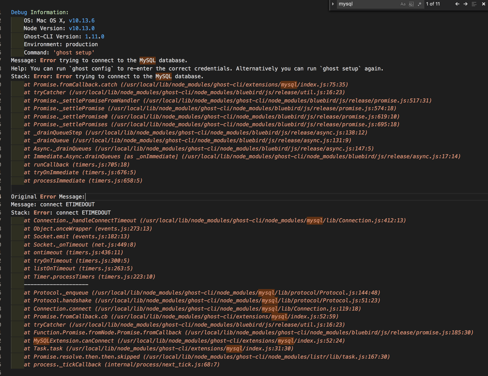

## Deploying with AWS
### Team Members
**Jorie, Williams O., Kishor, Jen Shin**

### Testing Ghost locally:
1.	Fork and clone the repo: https://github.com/tryghost/ghost
2.	Check if you have the correct version to run node.js (should be Node10
`node --version`
To install correct version: 
```npm install -g n```
```n 10```
3.	Follow the instructions on running the ghost locally by following the documentation:
a.	```$ npm install ghost-cli -g```
b.	Go outside the Ghost directory and create an empty directory.
```mkdir [directory name]``` i.e ```mkdir ghost_empty```
c.	Type in ```ghost install local```
### Setting-up for deployment
1.	Update configuration file for mysql by navigating to directory: core > server > config > env > config.production.json. Here, you can set up username, password, and database name.
2.	On package.json, find mysql and update version i.e 5.5.46

3. added url to config prod -> elastic beanstalk url
4. changed port to 8081
5. reverted mysql version back to 2.17.1 -> npm install fails
6. unable to connect to AWS RDS

### RDS SetUp
1. Choose mysql
2. Choose version (we chose 5.5.46)


### Code Pipeline
1. Create new pipeline

2. In deployment, choose your ElasticBeanstalk environment

### Blockers
1. Setting up config for mysql
2. How to connect db to application -- tried various methods which were not successful

3. mySql dependency version conflicts



